# Parasol Demo Deployment

This content is a recipe to deploy the Parasol demo on a RHOAI cluster. Following the instructions, you will have on your cluster:

- A namespace, `parasol-demo-llms`, where the LLM models used in the demo will be deployed.
- A dedicated namespace, `parasol-demo`, where the other artifacts will be deployed:
  - A Minio storage space for the pictures.
  - A MySQL database for the claims content.
  - A deployment of the image recognition model using ModelMesh.
  - A Workbench created and populated with the content of the Lab.

## Prerequisites

- An OpenShift cluster with at least one GPU with 24GB of VRAM.
- OpenShift AI deployed and configured (default configuration OK). This deployment only works on version 2.x of RHOAI, and has been tested on versions 2.19.x and 2.22.x.
- Admin access to OpenShift AI to create custom runtimes and images.
- Accelerator/Hardware profile configured to use the GPU.
- All files referenced in the instructions are in the [files](files) folder.

## LLMs Deployment

### Project initialization

- Open **OpenShift AI Dashboard**. Log in as an **Admin** of OpenShift AI.

- In **Data Science Project**, click on **Create Project**:
  
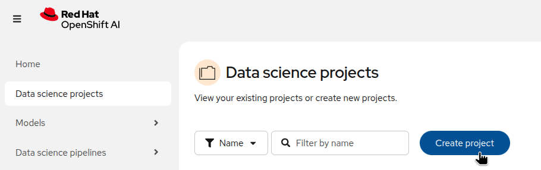

- Enter `parasol-demo-llms` and click on **Create**.

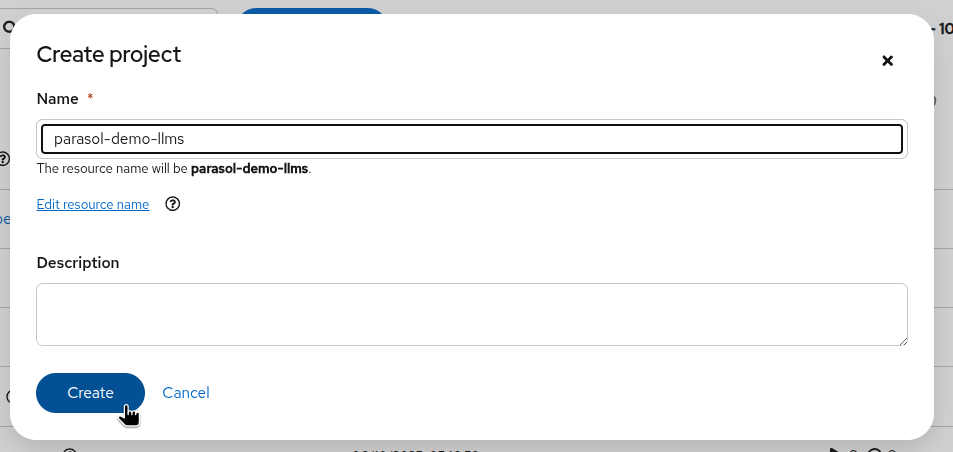

- In the newly created **parasol-demo-llms** data science project, go to the **Models** tab and click on **Select single-model**:

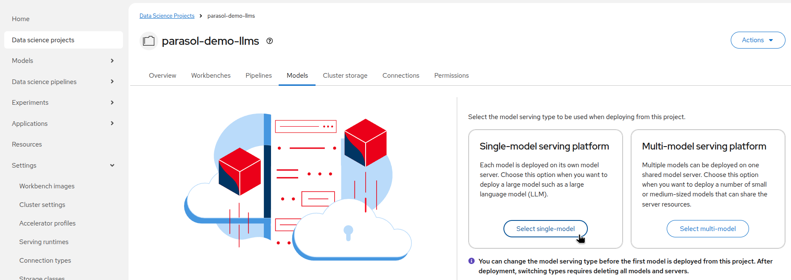

That's it for the moment. We will deploy everything else using YAML files in the OpenShift console.

### Models deployment

We will first deploy the Qwen Model.

- Switch to the **OpenShift Console** and navigate to the project `parasol-demo-llms`:

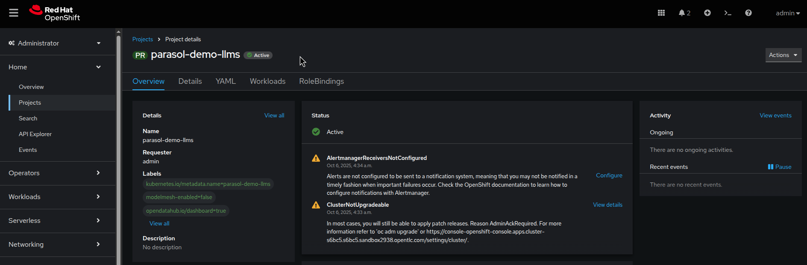

- Click on the **Quick create** button at the top right and select **Import YAML**:

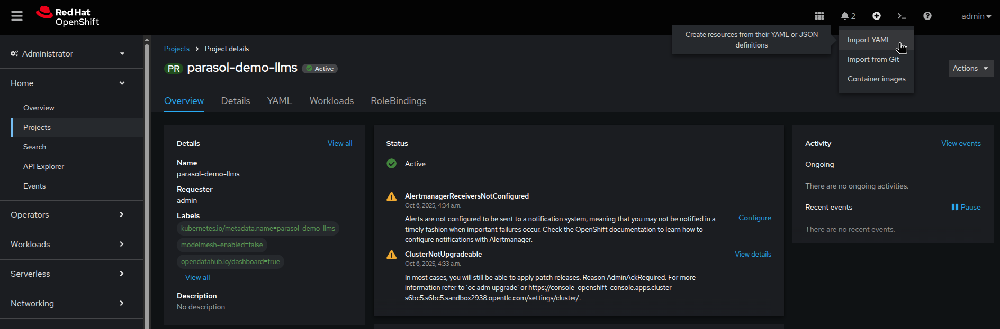

- Copy and paste the content from the file [serving-runtime-vllm-cpu-qwen-modelcar.yaml](files/llms/1-serving-runtime-vllm-cpu-qwen-modelcar.yaml) and click on **Create**.

- After the Serving Runtime has been created, click again on the **Quick create** button at the top right and select **Import YAML**.

- Copy and paste the content from the file [inference-service-qwen-modelcar.yaml](files/llms/2-inference-service-qwen-modelcar.yaml) and click on **Create**.

- Still in **OpenShift Console**, you can switch to the **Pods** view. You should see the model Pod starting and then running:

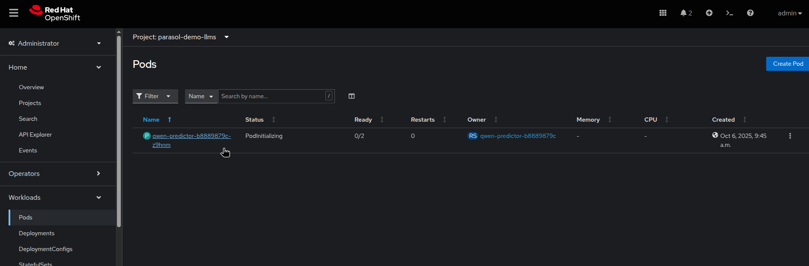

We will now deploy the Granite model.

- Still in the **OpenShift Console**, make sure you use the project `parasol-demo-llms`.
- Click on the **Quick create** button at the top right and select **Import YAML**.
- Copy and paste the content from the file [serving-runtime-vllm-granite-modelcar.yaml](files/llms/3-serving-runtime-vllm-granite-modelcar.yaml) and click on **Create**.
- After the Serving Runtime has been created, click again on the **Quick create** button at the top right and select **Import YAML**.
- Copy and paste the content from the file [inference-service-granite-modelcar.yaml](files/llms/4-inference-service-granite-modelcar.yaml) and click on **Create**.
- Still in **OpenShift Console**, switch to the **Pods** view. You should see the new model Pod starting and then running (it can take some time, up to 10 minutes, as this is a bigger model and the container images have to be downloaded):

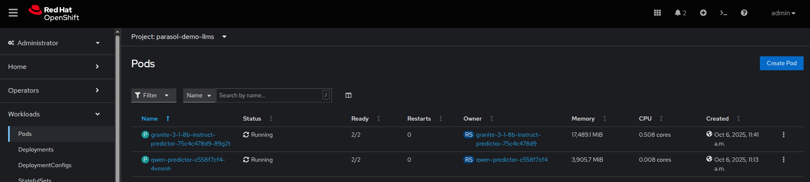

Perfect, our two models are now fully deployed.

## Application deployment

### Project initialization

- Open or switch back to the **OpenShift AI Dashboard**.
- In **Data Science Project**, click on **Create Project**.
- Enter `parasol-demo` and click on **Create**.

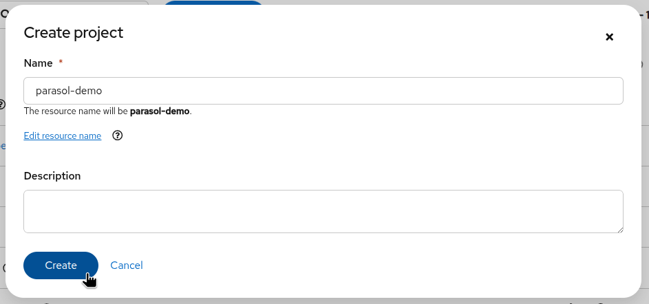

- In the newly created **parasol-demo** data science project, go to the **Models** tab and click on **Select Multi-model serving platform**:

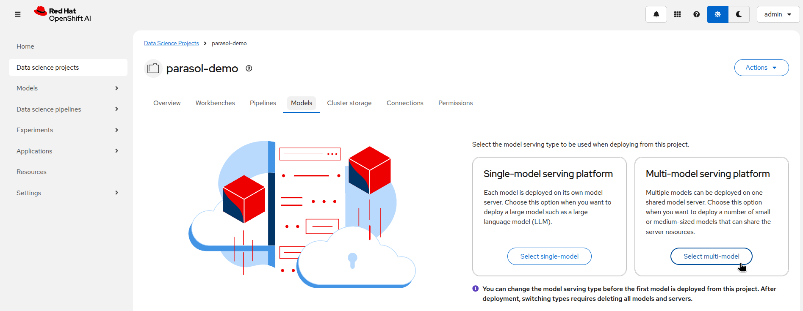

That's it for the moment. We will deploy everything else using YAML files in the OpenShift console.

### Minio deployment

- Switch to the **OpenShift Console** and navigate to the project `parasol-demo`.
- For each of the following files, in this order, click on the **Quick create** button at the top right, select **Import YAML**, copy and paste the content of the file, and click on **Create**.
  - [1-pvc.yaml](files/minio/1-pvc.yaml)
  - [2-secret.yaml](files/minio/2-secret.yaml)
  - [3-deployment.yaml](files/minio/3-deployment.yaml)
  - [4-service.yaml](files/minio/4-service.yaml)
  - [5-route.yaml](files/minio/5-route.yaml)
  - [6-create-data-connection.yaml](files/minio/6-create-data-connection.yaml)
  - [7-create-buckets.yaml](files/minio/7-create-buckets.yaml)

### Database deployment

- Switch to the **OpenShift Console** and navigate to the project `parasol-demo`.
- For each of the following files, in this order, click on the **Quick create** button at the top right, select **Import YAML**, copy and paste the content of the file, and click on **Create**.
  - [1-pvc.yaml](files/database/1-pvc.yaml)
  - [2-secret.yaml](files/database/2-secret.yaml)
  - [3-secret-minio.yaml](files/database/3-secret-minio.yaml)
  - [4-deployment.yaml](files/database/4-deployment.yaml)
  - [5-service.yaml](files/database/5-service.yaml)
  - [6-route.yaml](files/database/6-route.yaml)
  - [7-db-init-job.yaml](files/database/7-db-init-job.yaml)
  - [8-populate-images.yaml](files/database/8-populate-images.yaml)

### Milvus deployment

- Switch to the **OpenShift Console** and create a new project `parasol-demo-milvus` (Milvus has to be in a separate project to avoid conflicts with Minio). You can also use the file [0-namespace.yaml](files/milvus/0-namespace.yaml) to create the project.
- For each of the following files, in this order, click on the **Quick create** button at the top right, select **Import YAML**, copy and paste the content of the file, and click on **Create**.
  - [1-milvus-config.yaml](files/milvus/1-milvus-config.yaml)
  - [2-milvus-backup-config.yaml](files/milvus/2-milvus-backup-config.yaml)
  - [3-milvus-pvc.yaml](files/milvus/3-milvus-pvc.yaml)
  - [4-milvus-deployment.yaml](files/milvus/4-milvus-deployment.yaml)
  - [5-milvus-services.yaml](files/milvus/5-milvus-services.yaml)
  - [6-milvus-backup-deployment.yaml](files/milvus/6-milvus-backup-deployment.yaml)
  - [7-milvus-backup-service.yaml](files/milvus/7-milvus-backup-service.yaml)
  - [8-milvus-restore-collection.yaml](files/milvus/8-milvus-restore-collection.yaml)

After all the resources have been created, you can switch to the **Pods** view and see the Milvus Pods running:

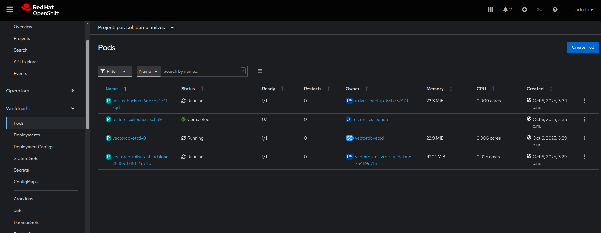

### Image recognition model deployment

- Switch to the **OpenShift Console** and navigate to the project `parasol-demo`.
- For each of the following files, in this order, click on the **Quick create** button at the top right, select **Import YAML**, copy and paste the content of the file, and click on **Create**.
  - [1-runtime.yaml](files/img-detect/1-runtime.yaml)
  - [2-model.yaml](files/img-detect/2-model.yaml)

Wait some time for the container images to be pulled and the **modelmesh-serving-...** Pod to start. Once started, if you go to the OpenShift AI Dashboard, in the **Parasol-demo** project, on the **Models** tab, you will be able to see your model running.

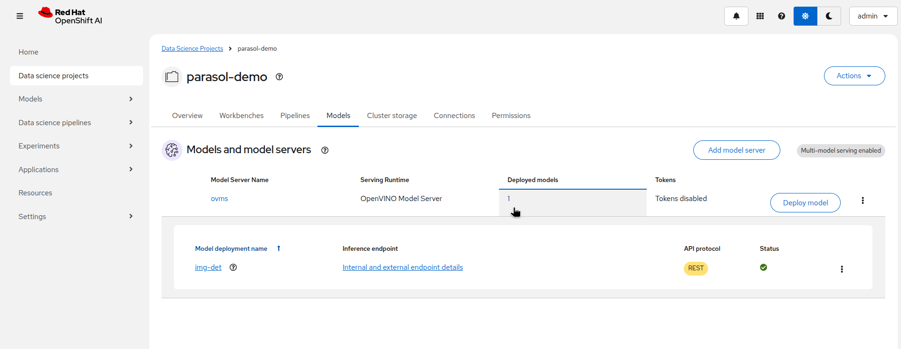

### Application deployment

- Switch to the **OpenShift Console** and navigate to the project `parasol-demo`.
- For each of the following files, in this order, click on the **Quick create** button at the top right, select **Import YAML**, copy and paste the content of the file, and click on **Create**.
  - [1-deployment.yaml](files/app/1-deployment.yaml)
  - [2-service.yaml](files/app/2-service.yaml)
  - [3-route.yaml](files/app/3-route.yaml)
- After all the resources have been created, you can switch to the **Pods** view and see the Application Pod running:

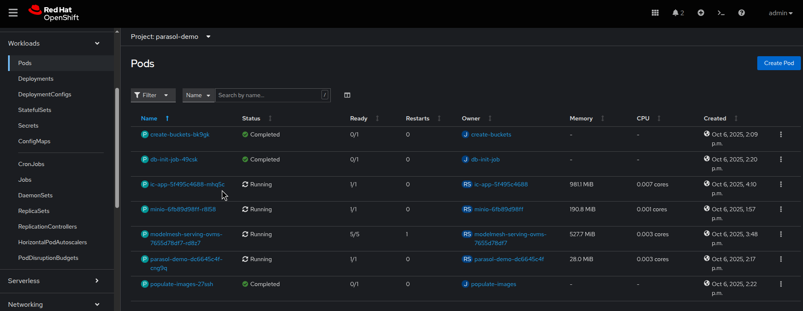

- You can connect to the app using the Route you created:

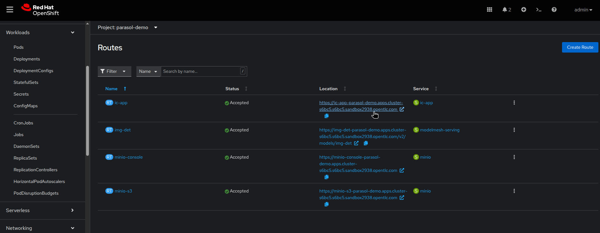

The demo application is now ready!

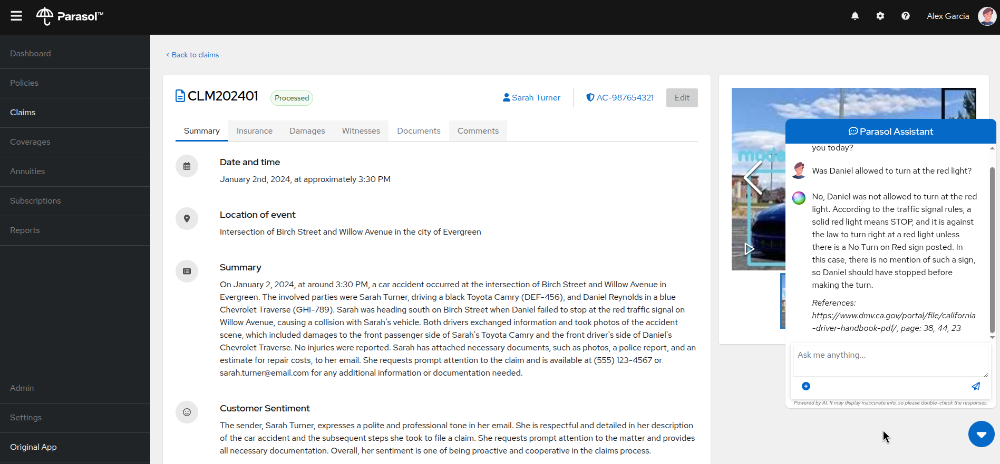

## Workshop notebooks

You can use the different notebooks used in the workshop in your OpenShift AI environment. The easiest way to make sure you have the right libraries is to first create custom Workbench images.

- Switch to the **OpenShift Console** and navigate to the project `redhat-ods-applications`.
- Click on the **Quick create** button at the top right, select **Import YAML**, copy and paste the content of the following file, and click on **Create**.
  - [workbench-imagestream.yaml](files/workbench/workbench-imagestream.yaml)

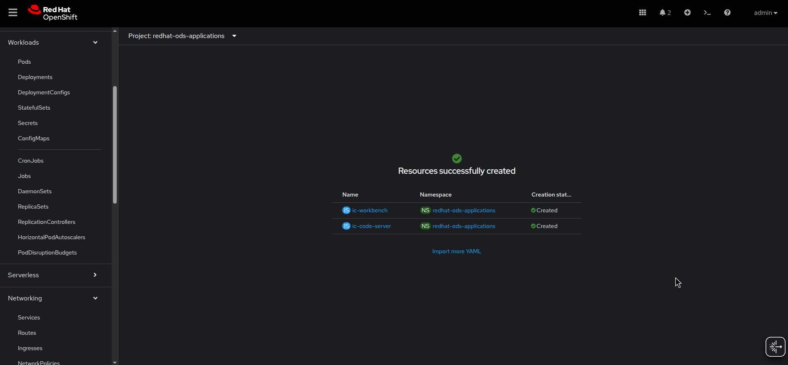

- Go back to OpenShift AI, in your project `parasol-demo`.
- On the **Workbenches** tab, click on **Create Workbench**:

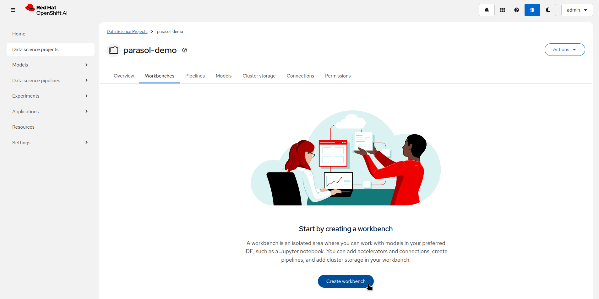

- Enter the following info:
  - Name: `Parasol`
  - Image Selection: `CUSTOM - Parasol Insurance Claim Processing Lab Workbench`
  - Container size: `Small`
  - Accelerator: `None`
  - Cluster Storage: leave at the default value
  - Connections: Attach existing connection -> Select Minio
- And click on **Create workbench**:

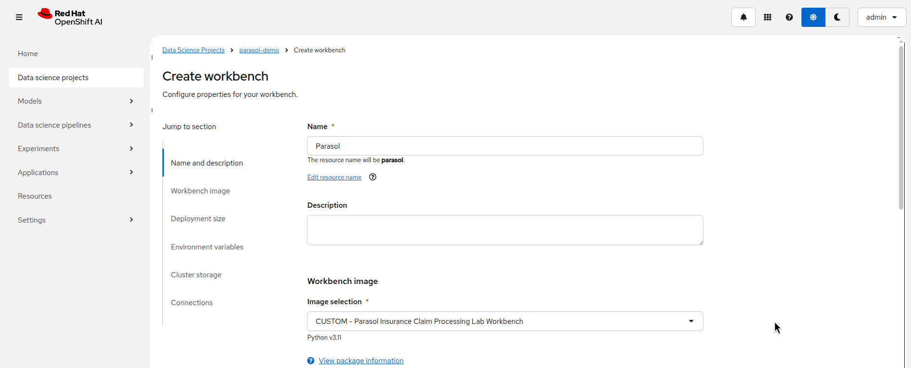
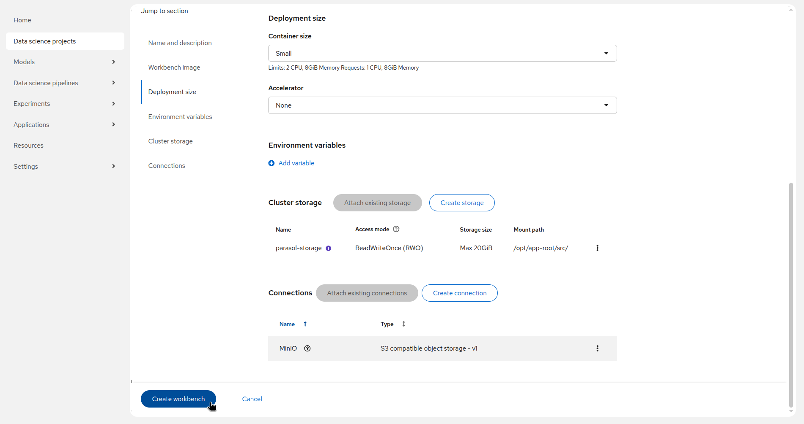

- Let the workbench start.
- Once started, clone the repo `https://github.com/rh-aiservices-bu/parasol-demo-deployment.git`.
- Navigate to `files/notebooks`.

You can now execute the notebooks in the different folders as you would do in the workshop.

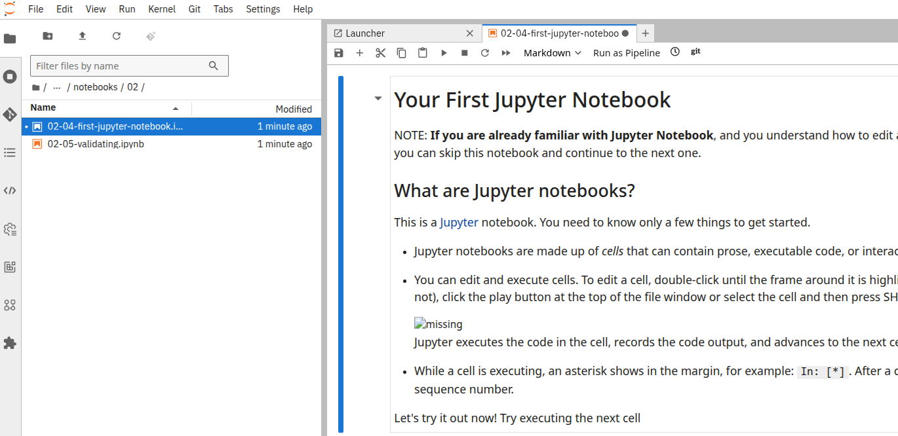
